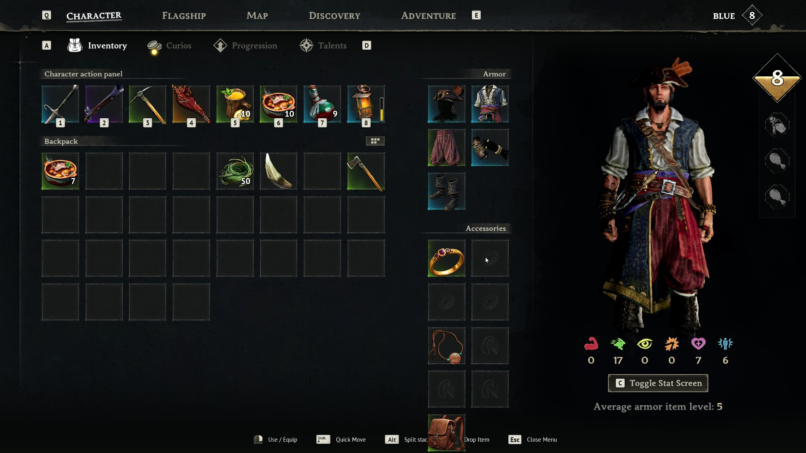
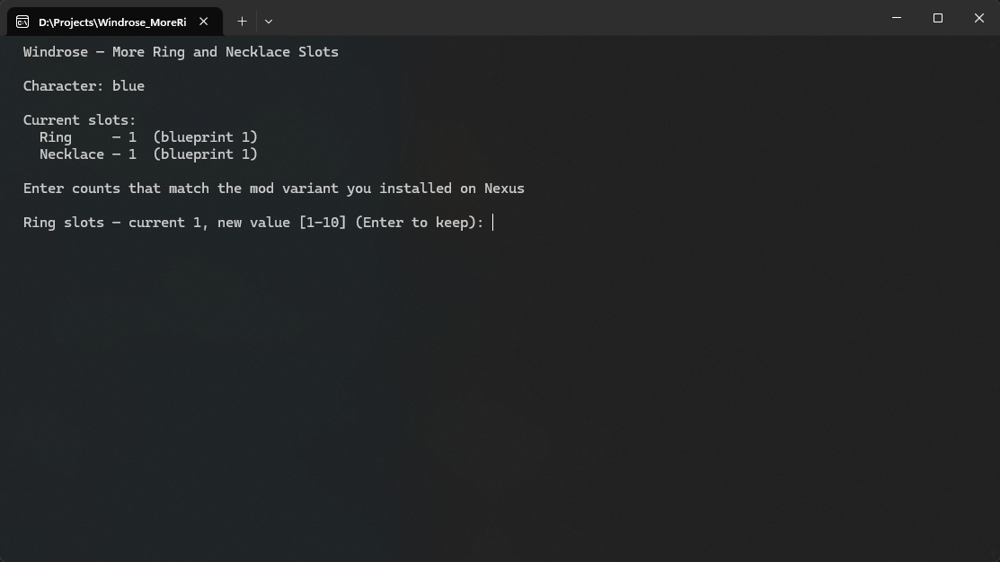
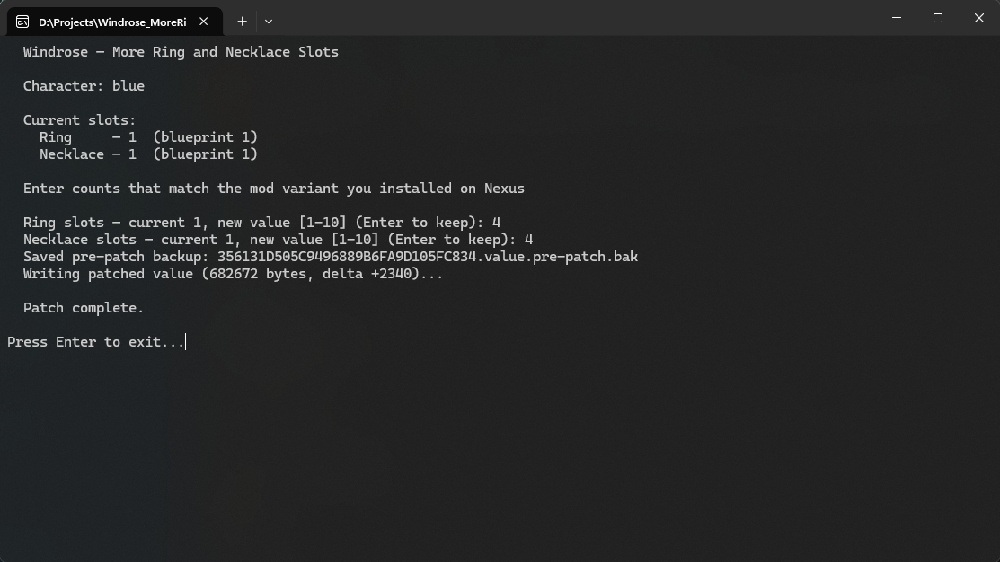
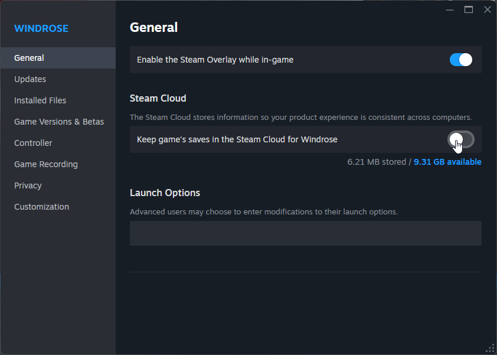

# Windrose - More Ring and Necklace Slots - Existing Character Patcher - v1.0

**This is not a mod. This is a tool for patching your existing Windrose characters to work with the existing Nexus mod [More Ring and Necklace Slots](https://www.nexusmods.com/windrose/mods/350) mod by Baradrim, so you don't need to make a new character to use the mod.**

If you are creating a new character with the mod install, you do not need this patcher.

## Preview

<table>
  <tr>
    <td colspan="2" align="center"><br/><em>Existing character with extra ring & necklace slots after patching</em></td>
  </tr>
  <tr>
    <td width="50%" align="center"><br/><em>1. Select the character to patch</em></td>
    <td width="50%" align="center"><br/><em>2. Enter the slot counts matching your Nexus mod variant</em></td>
  </tr>
  <tr>
    <td width="50%" align="center"><br/><em>3. Patch complete with pre-patch backup saved</em></td>
    <td width="50%" align="center"><br/><em>4. Temporarily disable Steam Cloud Sync before launching</em></td>
  </tr>
</table>

> [!NOTE]
> Ensure you have [More Ring and Necklace Slots mod](https://www.nexusmods.com/windrose/mods/350) by Baradrim installed. You can double check that it is working by creating a new character, and checking in the tutorial to see if you have the extra slots.

> [!CAUTION]
> It is **HIGHLY RECOMMENDED** that you **create a backup of your save folder**. Scroll down to see how. 
>
> Windrose is constantly updating and mods and tooling usually lag behind. Ensure you are taking the best steps to protect your saves.

## How to Use
> [!IMPORTANT]
> You must *temporarily disable Steam Cloud Sync* for Windrose before relaunching the game. When you launch the game, Steam pulls your old save from the cloud and overwrites the new patched save. You can and should re-enable it after you verify the patcher has worked.
>
> In **Steam** → right-click Windrose → Properties → General → uncheck *"Keep game saves in the Steam Cloud"*.
>
> If Steam asks about a conflict, pick "Use Local files".

> [!NOTE]
> When the patcher asks for ring and necklace slot counts, enter values that **match the mod variant you installed** from Nexus (for example: 2 ring + 2 necklace, 4 ring + 4 necklace, or another combination offered by the mod).

### Running the patcher

1. Download the latest version of the patcher from [releases](https://github.com/DeveloperBlue/windrose-mrns-existing-character-patcher/releases)
2. Disable Steam Cloud Sync.<br/>In Steam → right-click Windrose → Properties → General → uncheck "Keep game saves in the Steam Cloud".
3. Run the patcher and follow the instructions
4. Launch the game and verify that you have the extra slots
5. Close the game and re-enable Steam Cloud Sync

I apologize if Chrome, Windows Defender, or your Antivirus flags the file as a virus. This is just the nature of all unsigned *.exe files. If this is not acceptable for you, consider building from source yourself.

[🛡️ View VirusTotal Scan Report](https://www.virustotal.com/gui/file-analysis/ODI2MzBiY2QxNzMwN2UwYjE2NjVlN2IwYmRlYjhhODg6MTc3OTM1MTI3Nw==)

----

If you've enjoyed this mod, want to see it maintained, or support any of my other projects, consider BuyMeACoffee!

<p align="left">
    <a href="https://buymeacoffee.com/michaelrooplall" target="_blank"></a>
</p>

---

# Building from source

If you are interested in building the code from source, follow these steps. If you don't know what this means, ignore this section.

You need [Python](https://www.python.org/) 3.10 or newer.

```bash
# Clone the project and open it
git clone https://github.com/DeveloperBlue/windrose-mrns-existing-character-patcher.git
cd windrose-mrns-existing-character-patcher

# Install dependencies:
pip install pyinstaller rocksdict

# Build
pyinstaller windrose_mrns_patcher.spec
```

The compiled `windrose_mrns_patcher.exe` can be found in the `dist\` folder.

----
# FAQs

## How to backup my saves?
Your saves can be found at  `%LOCALAPPDATA%\R5\Saved\SaveProfiles\<STEAM_ID>\`

I would create copies of the ``RocksDB_v2`` and ``RocksDB_v2_Backups`` folders. Note that Steam Cloud Sync modifies these folders, so keep your backups OUTSIDE of SavedProfiles.

## How do I disable Steam Cloud Saves?
In **Steam** → right-click Windrose → Properties → General → uncheck *"Keep game saves in the Steam Cloud"

Note that after applying the patch, **launching the game**, and verifying that you see your slots, you should **re-enable Steam Cloud Saves**.

## How do I report a bug
If you have discovered any bugs, feel free to leave an issue here on [GitHiub](https://github.com/DeveloperBlue/windrose-mrns-existing-character-patcher/issues) or send an email over to ``contact@michaelrooplall.com``.

## Undoing the patch

If you want to "undo" the patcher and remove the extra slots:
- Follow the "How to Use" section again, and specify "1" for the number of ring and necklace slots.
- Also remove the nexus mod if you don't want it to apply to future characters.

----
# Special Thanks
Special thanks to [agreenbeen/windrose-save-tool](https://github.com/agreenbeen/windrose-save-tool/tree/main) for the detailed information on how Windrose requires uncompressed saves for RocksDB-- solved a lot of headaches. 